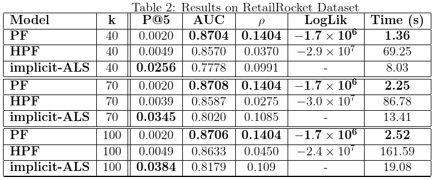
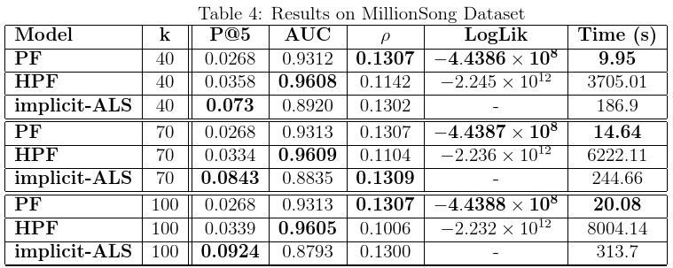

# Poisson Factorization

Very fast and memory-efficient non-negative matrix factorization for sparse data, based on Poisson likelihood with l2 regularization. The algorithm is described in the paper "Fast Non-Bayesian Poisson Factorization for Implicit-Feedback Recommendations":
[http://arxiv.org/abs/1811.01908](http://arxiv.org/abs/1811.01908)

The model is similar to [Hierarchical Poisson Factorization](https://arxiv.org/abs/1311.1704), but uses regularization instead of a bayesian hierarchical structure, and is fit through proximal gradient descent instead of variational inference, resulting in a procedure that, for larger datasets, can be more than 400x faster than HPF, and 15x faster than implicit-ALS as implemented in the package [implicit](https://github.com/benfred/implicit).

At the moment it does not have a complete API, only a function to optimize the user/item factor matrices in-place - a similar API to [hpfrec](https://www.github.com/david-cortes/hpfrec) will come in the future.

The implementation is in C with a Python interface. Parallelization is through OpenMP.




(_Statistics benchmarked on a Skylake server using 16 cores_)

# Installation

Clone or download the repository and then install with `setup.py`, e.g.:

```
git clone https://github.com/david-cortes/poismf.git
cd poismf
python setup.py install
```

Requires some BLAS library such as MKL (comes by default in Anaconda) or OpenBLAS - will attempt to use the same as NumPy is using, but you can also modify `setup.py` to provide a custom path to your implementation of choice if you need to. Also requires a C compiler such as GCC or Visual Studio.

** Note : parallelization (multithreading) will not work when compiling with Visual Studio. Use GCC for better performance. **

For any installation problems, please open an issue in GitHub providing information about your system (OS, BLAS, C compiler) and Python installation.

# Usage

In rough terms, you'll need to first initialize the user-factor and item-factor matrices yourself randomly (e.g. `~ Gamma(1,1)` or `~ Uniform(0,1)`), then run the optimization routine on them, passing the observed data in sparse coordinate format:

```python
import numpy as np
from scipy.sparse import coo_matrix

## Generating random sparse data
nusers = 10**5
nitems = 10**4
nobs = 10**6

## Sparse COO matrix (data, (row, col))
np.random.seed(1)
values = (np.random.gamma(1, 1, size=nobs) + 1).astype('int64') ## this is just to round values, they are casted anyway later
row_id = np.random.randint(nusers, size=nobs)
col_id = np.random.randint(nitems, size=nobs)
X = coo_matrix((values, (row_id, col_id)), shape=(nusers, nitems))

## Initializing paramters
k = 30 ## number of latent factors
np.random.seed(123)
A = np.random.gamma(1, 1, size=(nusers, k)) ## User factors
B = np.random.gamma(1, 1, size=(nitems, k)) ## Item factors

## Fitting the model
from poismf import run_pgd
run_pgd(X, A, B, ncores=1) ## adjust the number of threads/cores accordingly for your computer
## Matrices A and B are optimized in-place

## Full call
run_pgd(X, A, B, reg_param=1e9, step_size=1e-7, niter=10, npass=1, ncores=1)

## Making predictions
## Predict count of item 10 for user 25
np.dot(A[25], B[10])


### Be sure to check that your A and B matrices don't turn to NaNs to Zeros!!
```

You can also take the C file `poismf/pgd.c` and use it in some language other than Python - works with a copy of `X` in row-sparse and another in column-sparse formats.

```c
/* Main function
	A                           : Pointer to the already-initialized A matrix (user-factor)
	Xr, Xr_indptr, Xr_indices   : Pointers to the X matrix in row-sparse format
	B                           : Pointer to the already-initialized B matrix (item-factor)
	Xc, Xc_indptr, Xc_indices   : Pointers to the X matrix in column-sparse format
	dimA                        : Number of rows in the A matrix
	dimB                        : Number of rows in the B matrix
	nnz                         : Number of non-zero elements in the X matrix
	k                           : Dimensionality for the factorizing matrices (number of columns of A and B matrices)
	reg_param                   : Regularization pameter for the L2 norm of the A and B matrices
	step_size                   : Initial step size for PGD updates (will be decreased by 1/2 every iteration)
	numiter                     : Number of iterations for which to run the procedure
	npass                       : Number of updates to the same matrix per iteration
	ncores                      : Number of threads to use
Matrices A and B are optimized in-place.
Function does not have a return value.
*/
void run_poismf(
	double *restrict A, double *restrict Xr, size_t *restrict Xr_indptr, size_t *restrict Xr_indices,
	double *restrict B, double *restrict Xc, size_t *restrict Xc_indptr, size_t *restrict Xc_indices,
	const size_t dimA, const size_t dimB, const size_t nnz, const size_t k,
	const double reg_param, double step_size,
	const size_t numiter, const size_t npass, const int ncores)
```
