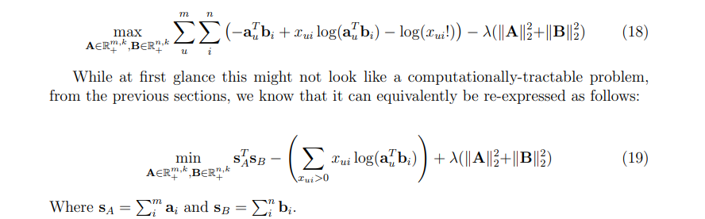

# Poisson Factorization

Very fast and memory-efficient non-negative matrix factorization for sparse counts data, based on Poisson likelihood with regularization. The algorithm is described in ["Fast Non-Bayesian Poisson Factorization for Implicit-Feedback Recommendations"](http://arxiv.org/abs/1811.01908) [*To be updated after last additions*].

The model is similar to [Hierarchical Poisson Factorization](https://arxiv.org/abs/1311.1704), but uses regularization instead of a bayesian hierarchical structure, and is fit through gradient-based methods instead of coordinate ascent.

The implementation is in C with interfaces for Python and R.

# Update 2020-23-05

The conjugate gradient method in this package has been reworked, and it's no longer susceptible to failed optimizations. Using the conjugate gradient method coupled with large numbers of iterations is now very competitive in terms of both quality and speed against HPF (Bayesian version), but it's nowhere near as fast as the proximal gradient version.

# Model description

This library tries to fit a low-rank factorization model in which some sparse `X` matrix of counts data is assumed to be Poisson-distributed, with parameters given by the product of two non-negative and lower-dimensional matrices - that is:
```X ~ Poisson(A * t(B))```.

The model is fit through maximum likelihood estimation (adding a regularization term) by alternating between updates to the `A` and `B` matrices, exploiting a shortcut for fast evaluation and optimization of Poisson likelihood when the `A` and `B` matrices are constrained to be non-negative and with no link function:


The intended use is for recommender systems, in which users are the rows of the `X` matrices, items the columns, and the non-zero values indicate interactions (e.g. clicks, views, plays, etc.) - the idea being that the items with the highest-predicted value for a given user are the best candidates to recommend. Nevertheless, can also be used for other domains such as topic modeling or as a general dimensionality reduction model - just take any mention of users as rows or documents and any mention of items as columns or words.

# Installation

* Python

Linux and MacOS + GCC:
```
pip install poismf
```
or
```
pip install git+https://www.github.com/david-cortes/poismf.git
```

(might also work on Windows depending on `setuptools` version)

Windows with unlucky `setuptools` version: clone or download the repository and then install with `setup.py`, e.g.:
```
git clone https://github.com/david-cortes/poismf.git
cd poismf
python setup.py install
```
(Note that it requires package `findblas`, can usually be installed with `pip install findblas`. Depending on configuration, in Windows you might also try `python setup.py install --compiler=msvc`).


MacOS without GCC: install OpenMP modules for CLANG (these don't come by default in apple's "special" clang distribution, even though they are part of standard clang), then install with either `pip install poismf` or `python setup.py install`.


Requires some BLAS library such as MKL (`pip install mkl-devel`) or OpenBLAS - will attempt to use the same as NumPy is using. Also requires a C compiler such as GCC or Visual Studio (in windows + conda, install Visual Studio Build Tools, and select package MSVC140 in the install options).

For any installation problems, please open an issue in GitHub providing information about your system (OS, BLAS, C compiler) and Python installation.

* R

Latest version (recommended):
```r
devtools::install_github("david-cortes/poismf")
```

Older version from CRAN:
```r
install.packages("poismf")
```


# Sample usage

* Python

(API is very similar to `cmfrec` library)
```python
import numpy as np, pandas as pd

## Generating random sparse data
nusers = 10 ** 2
nitems = 10 ** 3
nnz    = 10 ** 4

np.random.seed(1)
df = pd.DataFrame({
    'UserId' : np.random.randint(nusers, size = nnz),
    'ItemId' : np.random.randint(nitems, size = nnz),
    'Count'  : 1 + np.random.gamma(1, 1, size = nnz).astype(int)
})
### (can also pass a sparse COO matrix instead)

## Fitting the model
from poismf import PoisMF

### good speed
model = PoisMF(use_cg=False)
### good quality
model = PoisMF(use_cg=True)
model.fit(df)

### Predict functionality (chosen entries in X)
model.predict(1, 10) ## entry [1, 10]
model.predict(np.array([1,1,1]), np.array([4,5,6])) ## entries [1,4], [1,5], [1,6]

### Ranking functionality (for recommender systems)
model.topN(user=2, n=5, exclude=df.ItemId.loc[df.UserId==2])
model.topN_new(X=df[["ItemId","Count"]].loc[df.UserId==2],
    n=5, exclude=df.ItemId.loc[df.UserId==2])
## For faster fitting without any checks and castings, can use 'fit_unsafe' too
```

* R

(See example in the documentation for a slightly longer version)

```r
library(poismf)

### Create a random sparse data frame in COO format
nrow <- 10^2
ncol <- 10^3
nnz  <- 10^4
set.seed(1)
X <- data.frame(
    row_ix = sample(nrow, size=nnz, replace=TRUE),
    col_ix = sample(ncol, size=nnz, replace=TRUE),
    count  = rpois(nnz, 1) + 1)
X <- X[!duplicated(X[, c("row_ix", "col_ix")]), ]
### (can also pass as sparse matrix from Matrix or SparseM)

### Factorize the randomly-generated sparse matrix
### good speed
model <- poismf(X, use_cg=FALSE, nthreads=1)
### good quality
model <- poismf(X, use_cg=TRUE, nthreads=1)

### Predict functionality (chosen entries in X)
predict(model, 1, 10) ## entry [1, 10]
predict(model, c(1, 1, 1), c(4, 5, 6)) ## entries [1,4], [1,5], [1,6]

### Ranking functionality (for recommender systems)
topN(model, user=2, n=5, exclude=X$col_ix[X$row_ix==2])
topN.new(model, X=X[X$row_ix==2, c("col_ix","count")],
    n=5, exclude=X$col_ix[X$row_ix==2])
```

* C:

You can also take the C file `poismf/poismf.c` and use it in some language other than Python or R - works with a copy of `X` in row-sparse and another in column-sparse formats.

```c
/* Main function for Proximal Gradient and Conjugate Gradient solvers
    A                           : Pointer to the already-initialized A matrix
                                  (user factors)
    Xr, Xr_indptr, Xr_indices   : Pointers to the X matrix in row-sparse format
    B                           : Pointer to the already-initialized B matrix
                                  (item factors)
    Xc, Xc_indptr, Xc_indices   : Pointers to the X matrix in column-sparse format
    dimA                        : Number of rows in the A matrix
    dimB                        : Number of rows in the B matrix
    k                           : Dimensionality for the factorizing matrices
                                  (number of columns of A and B matrices)
    l2_reg                      : Regularization pameter for the L2 norm of the A and B matrices
    l1_reg                      : Regularization pameter for the L1 norm of the A and B matrices
    w_mult                      : Weight multiplier for the positive entries in X
    step_size                   : Initial step size for PGD updates
                                  (will be decreased by 1/2 every iteration - ignored for CG)
    use_cg                      : Whether to use a Conjugate-Gradient approach instead of Proximal-Gradient.
    limit_step                  : Whether to limit CG step sizes to zero-out one variable per step
    numiter                     : Number of iterations for which to run the procedure
    npass                       : Number of updates to the same vector per iteration
    nthreads                    : Number of threads to use
Matrices A and B are optimized in-place,
and are assumed to be in row-major order.
Returns 0 if it succeeds, 1 if it runs out of memory.
*/
int run_poismf(
    double *restrict A, double *restrict Xr, size_t *restrict Xr_indptr, size_t *restrict Xr_indices,
    double *restrict B, double *restrict Xc, size_t *restrict Xc_indptr, size_t *restrict Xc_indices,
    const size_t dimA, const size_t dimB, const size_t k,
    const double l2_reg, const double l1_reg, const double w_mult, double step_size,
    const bool use_cg, const bool limit_step, const size_t numiter, const size_t npass,
    const int nthreads)
```

# Documentation

* Python: available at [ReadTheDocs](https://poismf.readthedocs.io/en/latest/).

* R: documentation available internally (e.g. `help(poismf::poismf`)). PDF can be download at [CRAN](https://cran.r-project.org/web/packages/poismf/index.html).

* C: documentation available only for the main function, as given in the previous section.

# References

* Cortes, David. "Fast Non-Bayesian Poisson Factorization for Implicit-Feedback Recommendations." arXiv preprint arXiv:1811.01908 (2018).

* Li, Can. "A conjugate gradient type method for the nonnegative constraints optimization problems." Journal of Applied Mathematics 2013 (2013).
